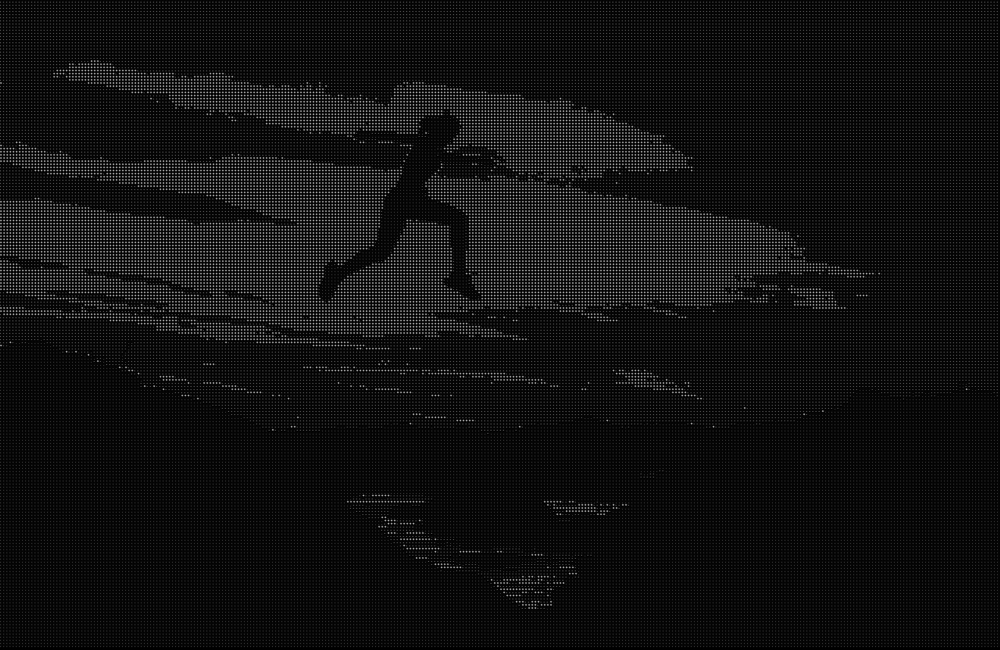
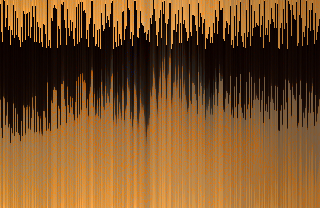
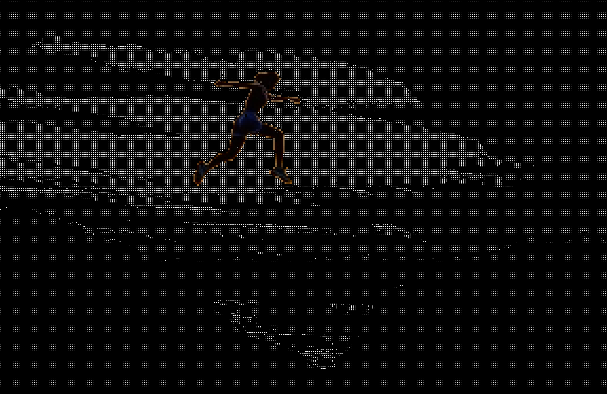
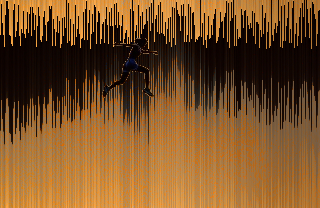

# ImageFilters

ImageFilters is a Java 21 project for applying image filters to images using a console-based GUI. The project currently offers two filters: Asciifilter and Pixelsort.

## Features

**Asciifilter**: Converts an image into ASCII art.



**Pixelsort**: Sorts the pixels of an image in every row by color and shifts the sorted pixels by a random amount.



**Mask Support**: You can use a mask image to selectively apply filters. The mask should consist out of black (apply filter) and white (ignore filter) pixels.

  

<sub> Example image source: https://github.com/yavuzceliker/sample-images/blob/main/images/image-1.jpg </sub>

## Usage

**Select a Filter**: Upon running the program, you'll be prompted to choose between the available filters: ASCII or Pixel Sort.

**Input Path**: Provide the path to your image file that you want to filter. Optionally, provide the path to a mask image (submit "" if you do not use a mask).

**Configuration**: Currently, there is no configuration file, but you can change the configuration through the following environmental variables to customize the output:

* ```BACKGROUND_COLOR```: Set the background color for Asciifilter.

* ```BRIGHTNESS_OFFSET```: Adjust the brightness offset in Asciifilter.

* ```CHAR_COLOR```: Define the character color for Asciifilter.

* ```FONT```: Set the font used for the Asciifilter rendering.

* ```FONT_SIZE```: Define the size of the font used in the Asciifilter rendering.

* ```MAX_PIXEL_SHIFT```: Set the maximum, random pixel shift for the Pixelsort filter.

* ```OUTPUT_PATH```: Specify the output path for the filtered image.

## Requirements

* Java 21 or higher

* Maven

## Getting Started

1. Clone the Repository
```
git clone https://github.com/colaenjoyernotfranky/Imagefilters.git
cd ImageFilters
```

2. Ensure that Java 21 or higher is installed on your system. You can verify your Java version with:
```
java -version
```

3. Compile the Project with Maven. Run:
```
mvn clean install
```

4. Run the Application using:
```
java -jar target/imagefilters-1.0.0.jar
```

## Contributing

Feel free to fork this repository and make your own modifications.
